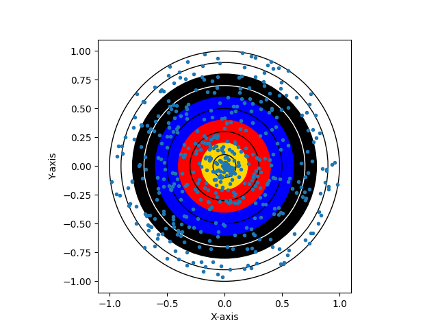
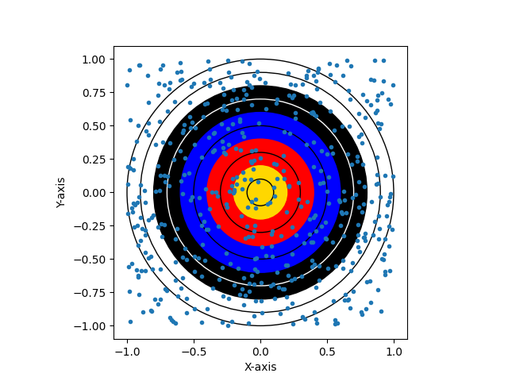

# archeryMontyCarlo

If you run monty.py, it will run a monty carlo simulation of an archery game (assuming no skill), and result in an example, such as seen in 'Figure_Uniform' or 'Figure_Radial' below:

Radial:

Uniform:

In terms of the accuracy of such a simulation, it is more accurate to run it radially, since Archers aim towards the centre, however because archers are not perfect, there is a slight bias against this and archers on occasion miss, so you can use the two models together to roughly estimate the expected score you would have if an archer was shooting without much skill. 

However, this fails to meaninfully measure people in terms of skill, necause as skill increases, since the archer aims at the gold, the arrows will naturally find themselves in the gold, more and more. A natural result of this will be that the average score increases. 
Hence, at a certain point you can actually ignore the Uniformly distributed model as the archer fails to miss eventually. 

However the radial model fails beyond this point because the arrows of the archer are consistently going into the gold at a high level of skill, however the model cannot do this since the radius of the model doesn't change. Thus you also need a factor that controls the expected radius of an arrow. If you havethese two variables, you can measure peak performance, however that is separate from measuring variation in performance. 

Thus you could use a factor that represents the percentage of misses an archer has, and have that tied to the probability of missing with the Uniform model, and a factor representing the expected radius an archer has, for the grouping. 

However, even this wouldn't be able to truly model an archery round because archers, while they aim at the gold, their grouping changes over time, so it is not a complete measure, but it is something. 

What these models are, is a way to measure if you are doing better than random luck. 
What these models are not, is a way to measure skill. No way of calculating accuracy can be measured using these models, and skill is slightly unrelated to accuracy. There is a correlation, however even if you are skilled, you can shoot badly with small samples or unusual conditions. Thus, higher levels of skill live within being able to counteract this multitude of forces to be able to be accurate. 

The two models I have are a Radially distributed model, and a more Uniformly distributed model. I call these, but you could argue that both are uniformly distributed against a corresponding parameter, since the radial model is uniformly distributed based on the radius, with a roughly equal number of points within each ring. However, because a circle's outer rings are bigger, this causes them to naturally have a much lower density of points than the inner most rings. 
The uniform model is uniformly distributed amongst the x and y axes. 

The current representation in figure 1 doesn't create random points radially, but alone the two axes. It's not a large change, just using a radius from a centre point and an angle. Realistically the angle doesn't matter for the distribution but makes it more apparent seeing it around the centre instead of one line going in one direction. If I ever get back to this project, I shall implement this functionality. 
